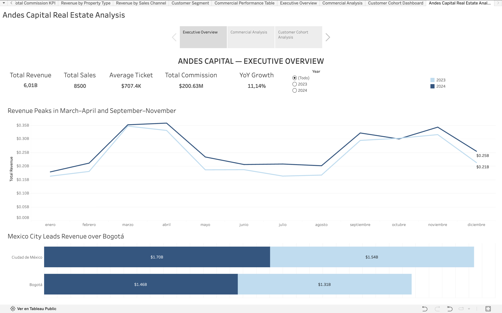
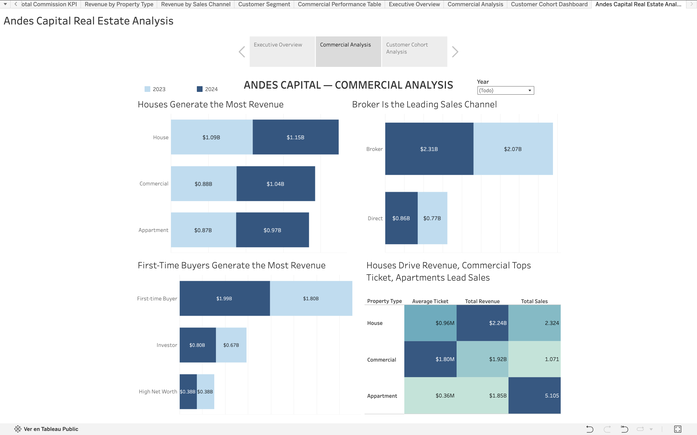
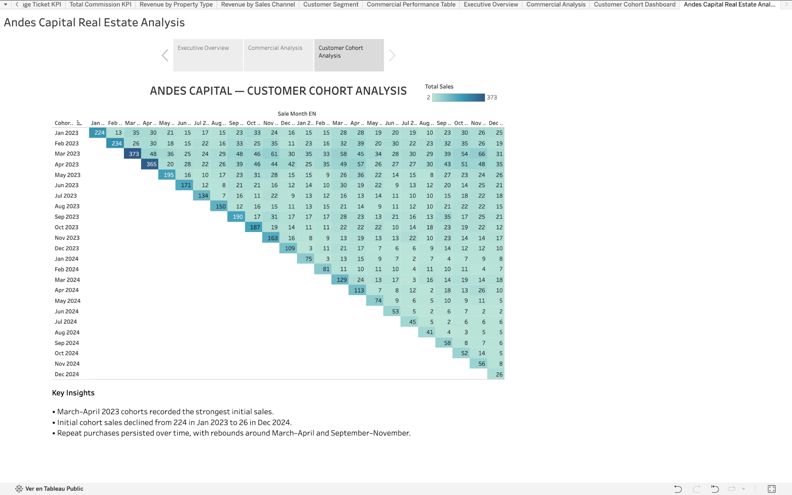

# Andes Capital Real Estate Analysis 2023–2024

**Author:** Rodrigo Garza García  
**Role:** Strategy & Public Affairs | Business Analysis & Data Analytics  
**Portfolio:** [GitHub Profile](https://github.com/rogarzag)

Real estate commercial performance analysis and interactive Tableau story for **Andes Capital**, covering revenue, sales, property types, sales channels, customer segments, geography, time trends, and customer cohorts across 2023–2024.

## 📊 Interactive Dashboard

Explore the full interactive story on Tableau Public:

[View Dashboard on Tableau Public](https://public.tableau.com/views/AndesCapitalRealEstateDashboard/AndesCapitalRealEstateAnalysis?:language=es-ES&:sid=&:redirect=auth&:display_count=n&:origin=viz_share_link)

## 🎯 Business Objective

This project analyzes Andes Capital's real estate sales performance and identifies the commercial, geographic, customer, and time patterns associated with that performance.

Three complementary views were developed:

- **Executive Overview:** executive view of KPIs, monthly revenue trends, city performance, and YoY growth.
- **Commercial Analysis:** deeper analysis of property types, sales channels, customer segments, and commercial performance.
- **Customer Cohort Analysis:** analysis of acquisition cohorts and repeat-purchase behavior over time.

## 📈 Executive Overview

### Main KPIs

| Metric | Result |
|---|---:|
| Total Revenue | **$6.01B** |
| Total Sales | **8,500** |
| Average Ticket | **$707.4K** |
| Total Commission | **$200.63M** |
| YoY Growth | **11.14%** |

## 🔎 Commercial Analysis

- **Houses** generated the highest total revenue.
- **Commercial properties** recorded the highest average ticket.
- **Apartments** led sales volume.
- The **Broker** channel generated approximately **73% of total revenue**.
- **First-Time Buyers** accounted for approximately **63% of total revenue**.

## 👥 Customer Cohort Analysis

- **March–April 2023 cohorts** recorded the strongest initial sales.
- Initial cohort sales declined from **224 in Jan 2023** to **26 in Dec 2024**.
- Repeat purchases remained present across cohorts, with rebounds around **March–April** and **September–November**.

## 💡 Key Findings

- Andes Capital generated **$6.01B in revenue** from **8,500 sales**.
- **Mexico City** generated more revenue than Bogotá.
- Revenue showed recurring peaks around **March–April** and **September–November**.
- Houses led revenue, Commercial properties led average ticket, and Apartments led sales volume.
- The Broker channel and First-Time Buyers represented the largest shares of revenue.
- Newer cohorts showed lower initial sales than early-2023 cohorts, while repeat purchasing remained visible over time.

## 📌 Recommended Next Steps

- Protect Broker-channel performance while testing opportunities to increase Direct-channel contribution.
- Prioritize First-Time Buyer acquisition and investigate the decline in initial sales among newer cohorts.
- Use Houses for revenue-driving strategies, Commercial properties for higher-ticket opportunities, and Apartments for volume-oriented strategies.
- Align campaigns and sales activity with recurring demand peaks around March–April and September–November.
- Continue monitoring cohort behavior to distinguish customer-acquisition changes from repeat-purchase patterns.

## 🛠 Tools

- Tableau Public
- Business Analysis
- Data Visualization
- KPI Analysis
- Cohort Analysis
- LOD Expressions
- Dashboard Design
- Data Storytelling

## 📓 Analysis Notebook

The portfolio version of the project notebook is available in this repository:

[`andes_capital_real_estate_analysis.ipynb`](notebook/andes_capital_real_estate_analysis.ipynb)

## 🔗 Tableau Public

[Explore the interactive workbook](https://public.tableau.com/views/AndesCapitalRealEstateDashboard/AndesCapitalRealEstateAnalysis?:language=es-ES&:sid=&:redirect=auth&:display_count=n&:origin=viz_share_link)

> The raw course dataset is not included in this repository.
